<!DOCTYPE html>
<html lang="ko">
<head>
	<meta charset="UTF-8">
	<meta name="viewport" content="width=device-width, initial-scale=1.0">
	<title>코코몬드 개발중</title>
	<link href="stylesheets/scrolling-nav.css" rel="stylesheet">
	<link rel="stylesheet" href="stylesheets/header_footer.css">
	<link rel="stylesheet" href="stylesheets/content.css">
	
	
	<link rel="stylesheet" href="http://cdn.jsdelivr.net/xeicon/2/xeicon.min.css">
	
	
	
	
	
	
</head>
<body id="page-top" data-spy="scroll" data-target=".navbar-fixed-top">	
	<!--헤더-->
	<header class="navbar navbar-default navbar-fixed-top" role="navigation">
		

			
		

	
		<nav class="pc_nav collapse navbar-collapse navbar-ex1-collapse">
		   <ul class="nav navbar-nav menu_hover">
					<li><a class="page-scroll" href="#about_cm">브랜드소개</a></li>
					<li><a class="page-scroll" href="#point3s">제품특징</a></li>
					<li><a class="page-scroll" href="#babyoil_ani">베이비오일</a></li>
					<li class="logo_pc"></li>
					<li><a class="page-scroll" href="#momoil_ani">맘오일</a></li>
					<li><a class="page-scroll" href="#package_info">패키지특징</a></li>
					<li><a class="page-scroll" href="massage.html">마사지방법</a></li>
					<li><a class="page-scroll" href="#none">SHOP</a></li>
			</ul>
		</nav>
		
		<!--모바일페이지 menu-->
		<nav class="mb_nav collapse navbar-collapse navbar-ex1-collapse">
			

			
  

			

				<ul class="nav navbar-nav menu_hover">
					<li><a class="page-scroll" href="#about_cm">브랜드소개</a></li>
					<li><a class="page-scroll" href="#point3s">제품특징</a></li>
					<li><a class="page-scroll" href="#babyoil_ani">베이비오일</a></li>
					<li><a class="page-scroll" href="#momoil_ani">맘오일</a></li>
					<li><a class="page-scroll" href="#package_info">패키지특징</a></li>
					<li><a class="page-scroll" href="massage.html">마사지방법</a></li>
					<li><a class="page-scroll" href="#none">SHOP</a></li>
				</ul>
			

		</nav>
		<!--모바일페이지 menu End-->
	</header>
	<!--//헤더-->
	
	<!--content-->
	

	
		<!--main_banner 첫번째 페이지-->
		

			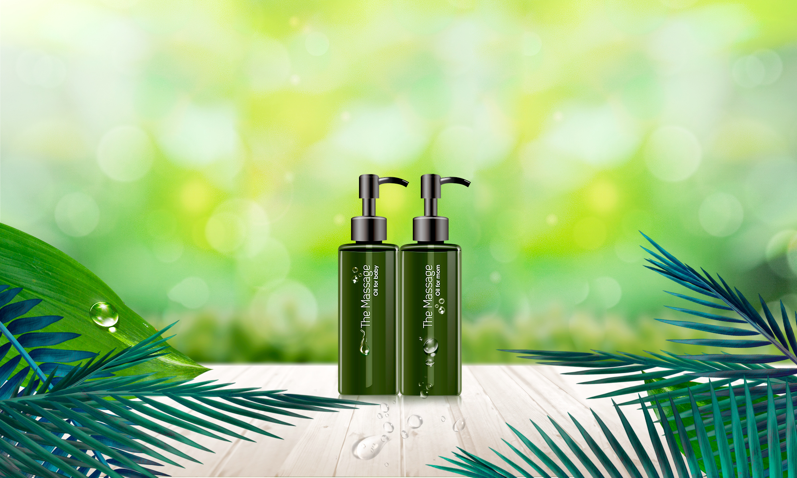
			
		

		<!--//main_banner END-->
		
		<!--about_cm 2번째 페이지 코코몽드란?-->
		

			

				<h1>#코코몽드</h1>
				
				<h1 class="title">cocomonde</h1>
				
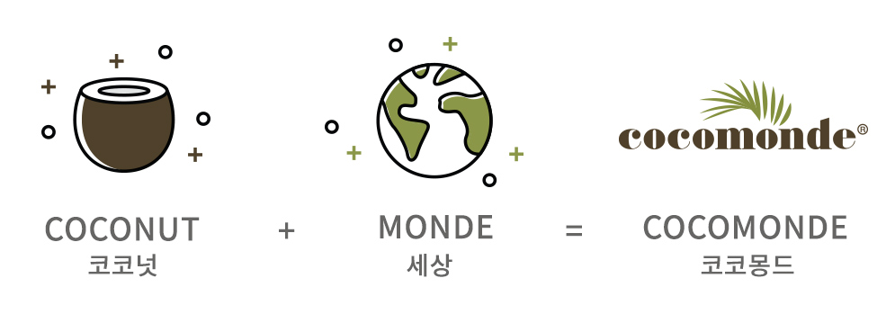

				

					

					임신한 순간부터 엄마는 아기를 생각합니다.  
					우리는 엄마의 고귀한 마음을 담아 코코몽드를 만들었습니다.   
					엄마와 아기를 생각하고 지구의 환경까지 생각하는게 코코몽드의 마음입니다.   
					

					

					코코몽드는 엄마의 피부관리까지 뱃속의 태아에게  
					좋은 영향을 줄 수 있는 맞춤형 솔루션입니다. 
					

					

					엄마의 피부를 보호하고 태아도 보호해주는 마사지 오일 코코몽드 
					

				

			

		
	
		<!--//about_cm END-->
		
		<!--point3s 3번째 페이지 코코몽드 3개의 포인트?-->
		

			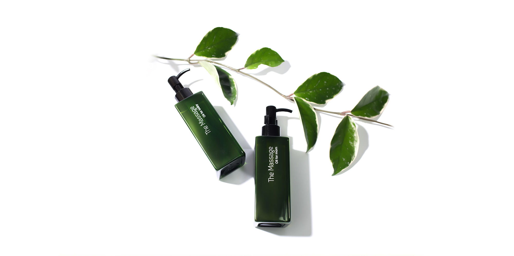
			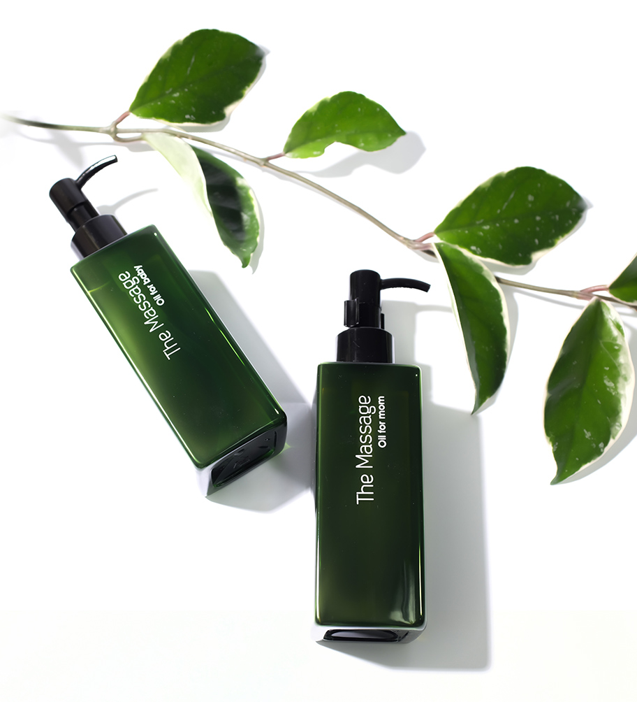
		

		
		

			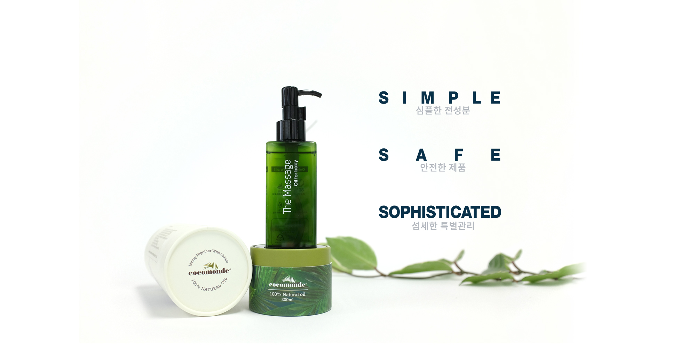
			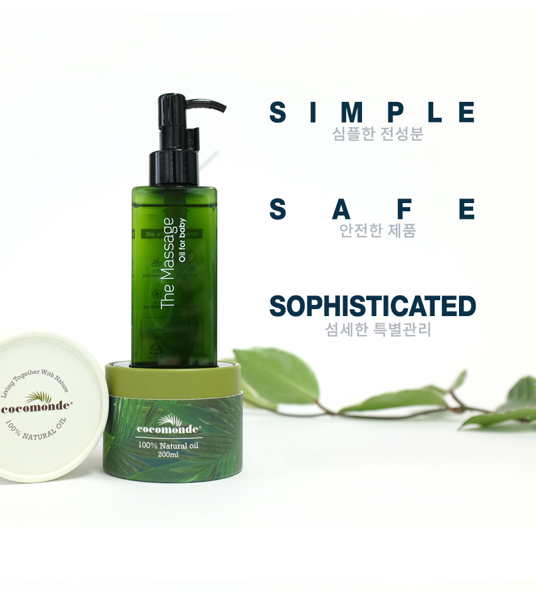
		
		
		<!--//point3s END-->
		
		<!--coconut_info 4번쨰 페이지 코코넛에 대한 정보-->	
		

			

				<h1>COCONUT</h1>
				

					단단한 껍질에 쌓여 있는 코코넛, 
					농약이나 화학물질 등의 오염으로부터 안전하기에  
					피부나 모발에 바르는 미용제품으로 안심하고 사용할 수 있습니다. 
					특히 분자 구조가 작기에 피부와 모발에 빠르게 흡수되며  
					사용감이 매끄럽고 부드럽습니다.  
					몸이나 얼굴에 바르면 피부를 햇볕으로부터 보호하는 역할을 해주며 
					피부 보호 외에도 피부의 각질을 제거하고 피부 재생을  
					촉진시켜 주는 역할을 합니다. 
				

				
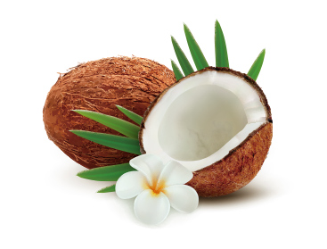

			

		
	
		<!--//coconut_info END-->
		
		<!--babyoil_ani 5번째 페이지 베이비오일 애니메이션 -->	
		

			

				<h2>The Massage</h2>
				
				<h2 class="title">Oil for baby</h2>
				

					

						
  

						
 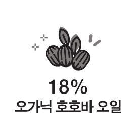 

					

					

						

							

						

					

					

						
  

						
  

						
 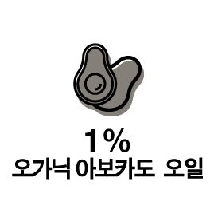 

						
  

					

				

			

		
	 
		<!--//babyoil_ani END-->
		
		<!--babyoil_info 6번째 페이지 베이비오일 특징 정보-->
		

			

				<h2>베이비 오일의 특징</h2>
				
				<h2></h2>
				
100% 천연성분으로 어떤 유해물질도 첨가하지 않은  
				순수 천연 유기농 마사지 오일입니다. 
				천연 보호막으로 외부 유해환경으로부터 우리 아기의 연약하고 
				민감한 피부를 보호하고 끈적임없이 자연스럽게 스며들어  
				피부를 촉촉하게 유지시켜 줍니다. 
				

				
			

		
		
		<!--//babyoil_info END-->
		
		<!--momoil_ani 7번째 페이지 맘오일 애니메이션-->
		

			

				<h2> The Massage</h2>
				
				<h2 class="title">Oil for mom</h2>
				

					

						
  

						
 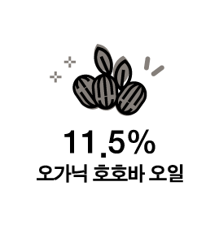 

					

					

						

							

						

					

					

						
  

						
  

						
						
 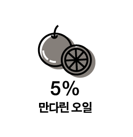 

						
 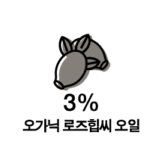 

						
 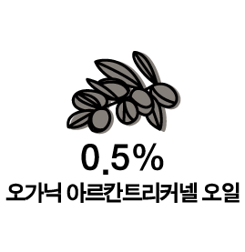 

					

					

						
  

					

				

			

		
	 
		<!--//momoil_ani END-->
		
		<!--momoil_info 8번째 페이지 맘오일 특징 정보-->
		

			

				<h2>맘 오일의 특징</h2>
				
				<h2>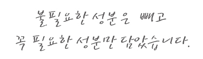</h2>
				
모유수유를 위해 가슴관리시 사용하는 오일은   
				아기들에게도 영향을 미친다는 사실 생각해 보셨나요?  
				아기 피부에 직접 닿는 부분이기 때문에 더 신경을 써야 합니다. 
				100% 천연오일로만 만들어진 cocomonde : The massage line 은  
				엄마의 가슴에 발라도 안심할수 있습니다. 
				

				
				
			

			
		
	
		
		

			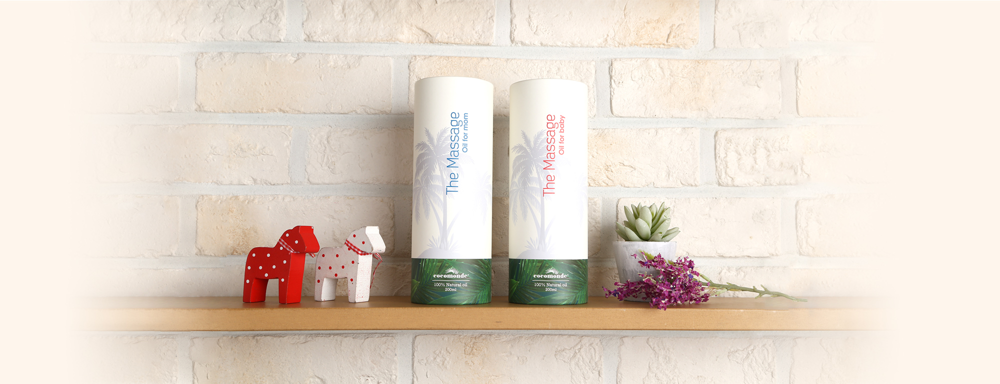	
			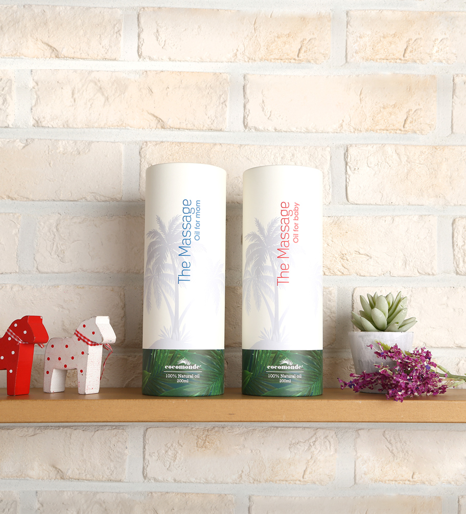
		
	
		<!--//momoil_info END-->
		
		<!--package_info 9번째 페이지 패키지 정보-->
		

			

				<h2>How to Use</h2>
				
				<h3>of Package</h3>
				

					코코몽드는 패키지 하나 까지도 cocomonde의 마음을 담아 만들었습니다.  
					받침대 하나도 오일을 사용해 보고 불편했던 점을 보완하여 좀더 편하게 
					좀 더 자연을 생각하며 만들었습니다. 
				

				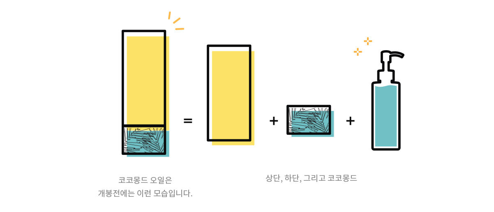
				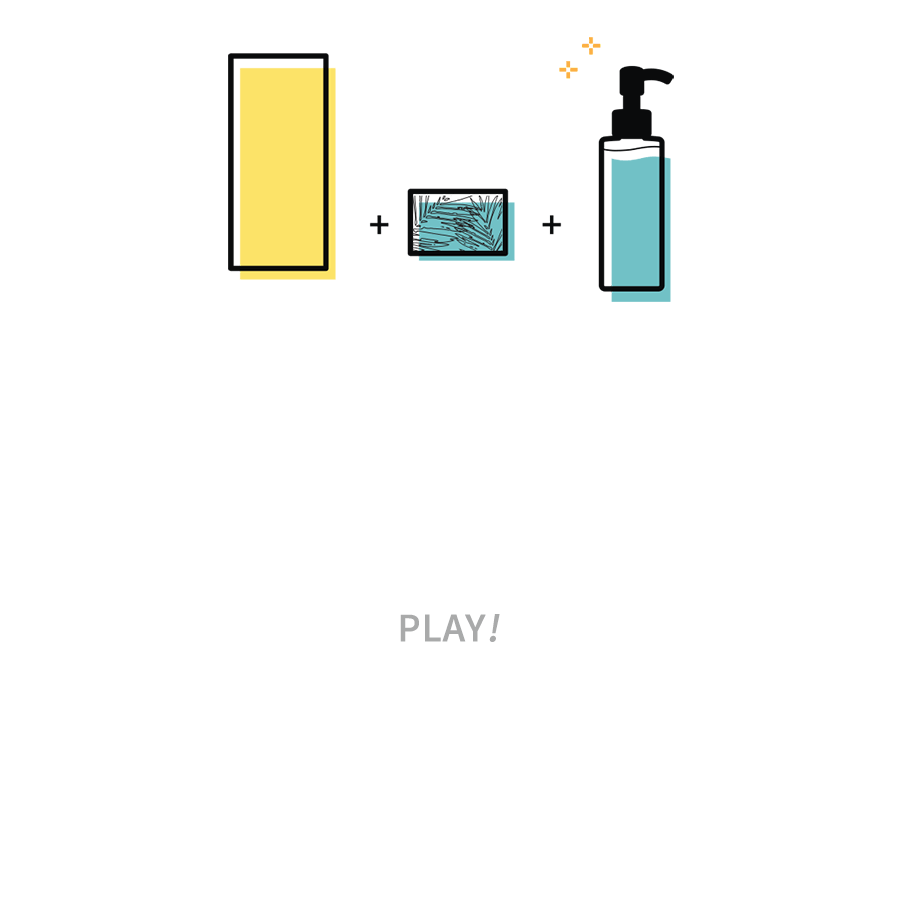
			

		
	
		<!--//package_info END-->
		
		<!--lastpage 10번째 패키지 정보-->
		

			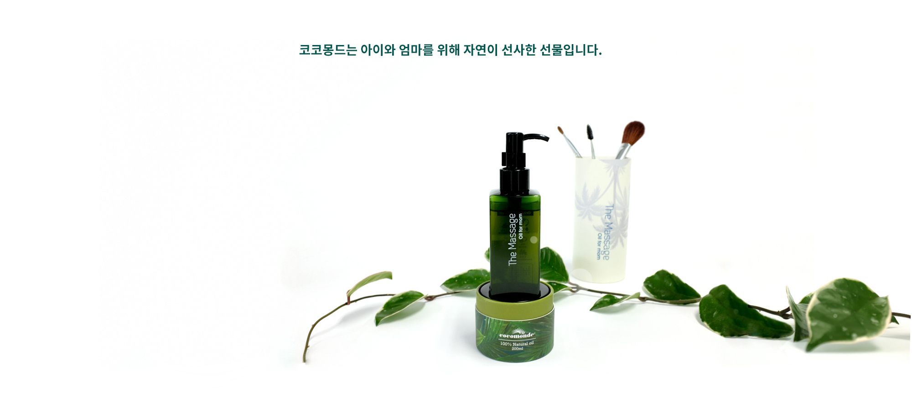
			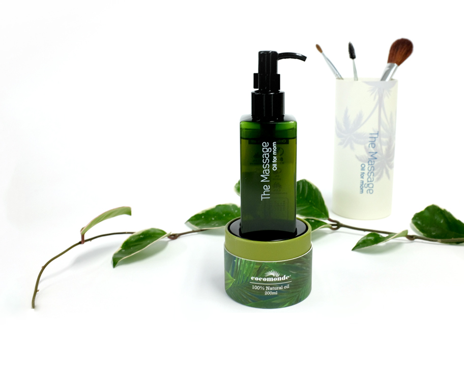
		
	
		<!--//lastpage 10번째 패키지 정보-->
	

	<!--//content-->
	
	<!--탑버튼-->
	

		<a href="#top">TOP<i class="xi-caret-up"></i></a>
	

    <!--//탑버튼-->
   
    <!--풋터 footer-->
	<footer>
		

			<ul>
				<li class="title">제조판매업자</li>
				<li>엠에이에스 인터내셔날(주)</li>
				<li>경기도 남양주시 진건읍 진관산단로 68</li>
			</ul>
			<ul>
				<li class="title">제조업자</li>
				<li>다비드 화장품</li>
				<li>경기도 부천시 오정구 석천로 453번길 64-17</li>
			</ul>
			
			<ul>
				<li class="title">고객센터</li>
				<li class="call">070 - 8677 - 3600  010 - 9081 - 2410</li>
			</ul>
		

	</footer>
	<!--//풋터 footer-->
	

</body>
</html>
